---
## Front matter
lang: ru-RU
title: Лабораторная работа №5. Дискреционное разграничение прав в Linux. Исследование влияния дополнительных атрибутов
author: Захарова Софья Михайловна

## Formatting
toc: false
slide_level: 2
##theme: metropolis
mainfont: PT Serif 
romanfont: PT Serif
sansfont: PT Sans
monofont: PT Mono
header-includes: 
## - '\metroset{progressbar=frametitle,sectionpage=progressbar,numbering=fraction}'
 - '\makeatletter'
## - '\beamer@ignorenonframefalse'
 - '\makeatother'
aspectratio: 43
section-titles: true
---
# Цель работы

Изучение механизмов изменения идентификаторов, применения SetUID и Sticky-битов. Получение практических навыков работы в консоли с дополнительными атрибутами. Рассмотрение работы механизма смены идентификатора процессов пользователей, а также влияние бита Sticky на запись и удаление файлов.

---
# Задание

Лабораторная работа подразумевает работу с виртуальной машиной VirtualBox, операционной системой Linux, дистрибутивом Centos и закрепление теоретических основ получения практических навыков работы в консоли с атрибутами файлов.

---
# Выполнение лабораторной работы

1. Вошла в систему от имени пользователя guest. (рис.1).

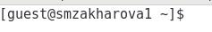{ #fig:001 width=50% }

---

2. Создала программу simpleid.c. (рис.2).

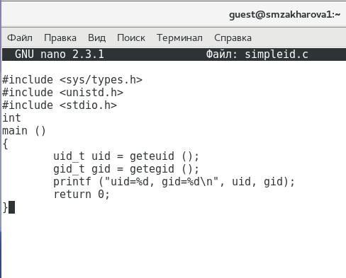{ #fig:002 width=50% }

---

3. Скомпилировала программу и убедилась, что файл программы создан (рис.3). 

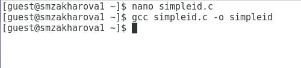{ #fig:003 width=50% }

---

4. Выполнила программу simpleid: ./simpleid (рис.4): 

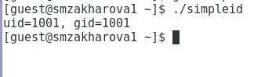{ #fig:004 width=50% }

---

5. Выполнила системную программу id и сравнила полученный результат с данными предыдущего пункта задания: программа работает верно, результаты совпадают. (рис.5):

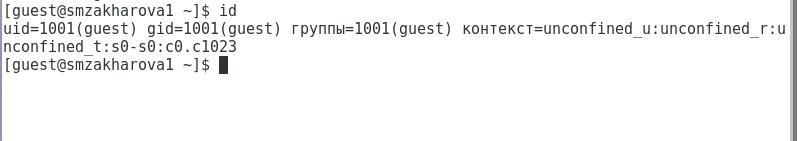{ #fig:005 width=50% }

---

6. Усложнила программу, добавив вывод действительных идентификаторов. Получившуюся программу назвала simpleid2.c (рис. 6).

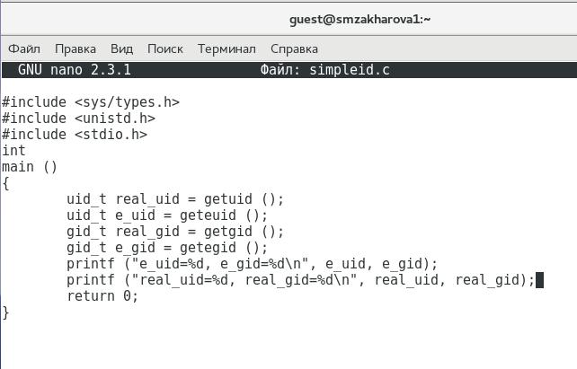{ #fig:006 width=50% }

---

7. Скомпилировала и запустила simpleid2.c (рис.7).

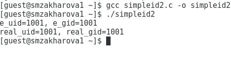{ #fig:007 width=50% }

---

8. От имени суперпользователя выполнила команды:
chown root:guest /home/guest/simpleid2
chmod u+s /home/guest/simpleid2
С помощью этих команд файлу simpleid2 изменила владельца и группу на root и guest соответственно, а также установила на файл SetUID-бит. (рис. 8).

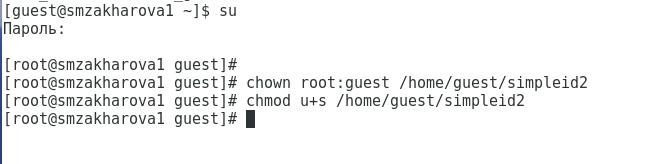{ #fig:008 width=50% }

---

9. Временно повысила свои права с помощью команды su (рис. 9).

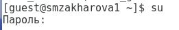{ #fig:009 width=50% }

---

10. Выполнила проверку правильности установки новых атрибутов и смены владельца файла simpleid2: ls –l simpleid2 (рис. 10).

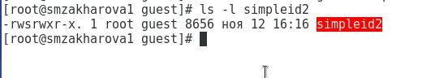{ #fig:010 width=50% }

---

11. Запустила simpleid2 и id. Результаты совпадают. (рис.11)

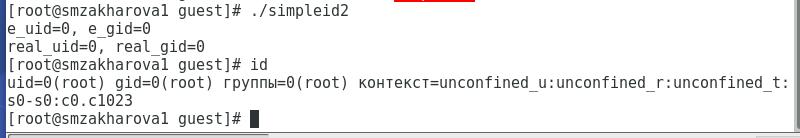{ #fig:011 width=50% }

---

12. Проделала тоже самое относительно SetGID-бита (рис.12). 

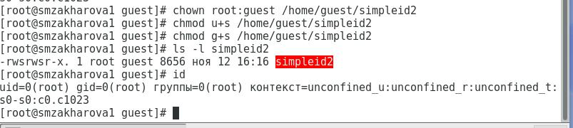{ #fig:012 width=50% }

---

13. Создала программу readfile.c (рис.13).

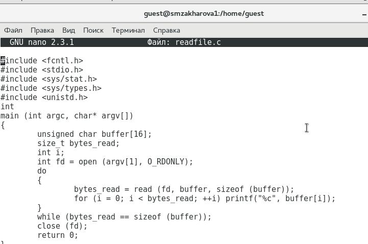{ #fig:013 width=50% }

---

14. Откомпилировала её (рис.14).

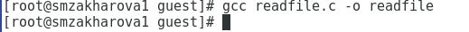{ #fig:014 width=50% }

---

15. Сменила владельца у файла readfile.c и изменила права так, чтобы только суперпользователь (root) мог прочитать его, a guest не мог (рис.15).

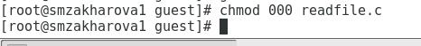{ #fig:015 width=50% }

---

16. Проверила, что пользователь guest не может прочитать файл readfile.c (рис.16).

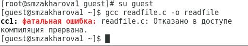{ #fig:016 width=50% }

---

17. Сменила у программы readfile владельца и установила SetU’D-бит (рис.17).

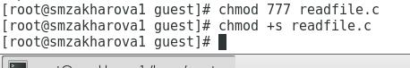{ #fig:017 width=50% }

---

18. Проверила, может ли программа readfile прочитать файл readfile.c (рис.18).

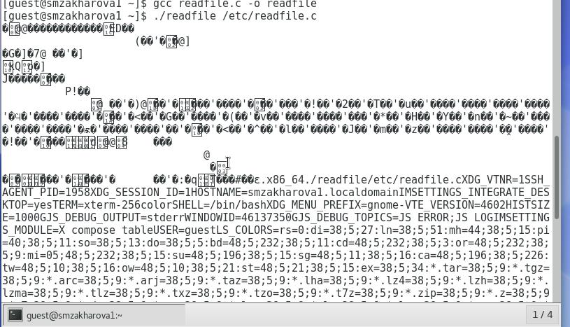{ #fig:018 width=50% }

---

19. Проверила, может ли программа readfile прочитать файл /etc/shadow. Может (рис.19).

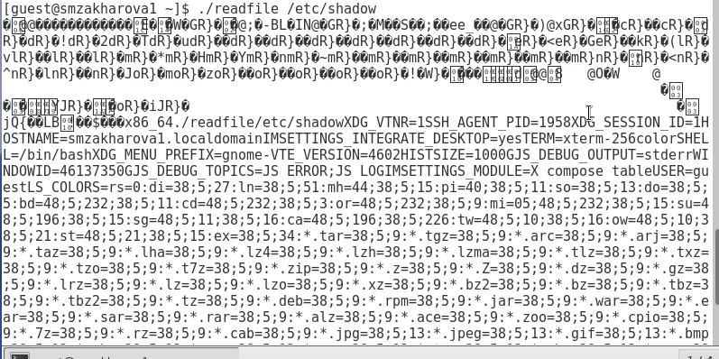{ #fig:019 width=50% }

---

20. Исследование Sticky-бита

Выяснила, установлен ли атрибут Sticky на директории /tmp, для чего выполнила команду ls -l / | grep tmp (рис.20).

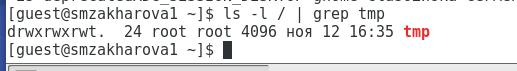{ #fig:020 width=50% }

---

21. От имени пользователя guest создала файл file01.txt в директории /tmp со словом test: echo &quot;test&quot; &gt; /tmp/file01.txt (рис.21).

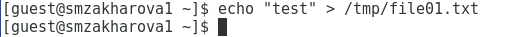{ #fig:021 width=50% }

---

22. Просмотрела атрибуты у только что созданного файла и разрешила чтение и запись для категории пользователей «все остальные». Первоначально все группы имели право на чтение, а запись могли осуществлять все, кроме «остальных пользователей» (рис.22).

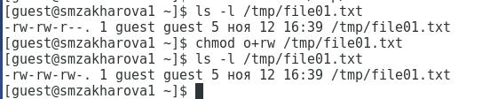{ #fig:022 width=50% }

---

23. От пользователя guest2 (не являющегося владельцем) попробовала прочитать файл /tmp/file01.txt (рис.23).

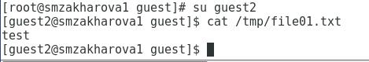{ #fig:023 width=50% }

---

24. От пользователя guest2 попробовала дозаписать в файл /tmp/file01.txt слово test2, стерев при этом всю имеющуюся в файле информацию с помощью команды echo &quot;test2&quot; &gt; /tmp/file01.txt. Выполнить операцию удалось (рис.24).

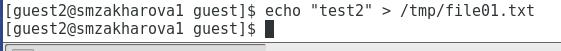{ #fig:024 width=50% }

---

25. Проверила содержимое файла командой cat /tmp/file01.txt (рис.25).

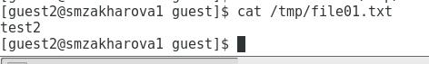{ #fig:025 width=50% }

---

26. От пользователя guest2 попробовала дозаписать в файл /tmp/file01.txt слово test3 командой echo &quot;test3&quot; &gt; /tmp/file01.txt. Выполнить операцию удалось (рис.26).

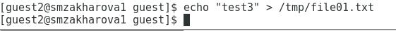{ #fig:026 width=50% }

---

27. Проверила содержимое файла командой cat /tmp/file01.txt (рис.27).

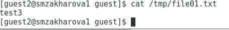{ #fig:027 width=50% }

---

28. От пользователя guest2 попробовала удалить файл /tmp/file01.txt c помощью команды rm /tmp/file0l.txt. Удалить файл не удалось (рис.28).

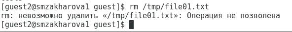{ #fig:028 width=50% }

---

29. Повысила свои права до суперпользователя командой su - и выполнил после этого команду, снимающую атрибут t (Sticky-бит) с директории /tmp: chmod –t /tmp (рис.29).

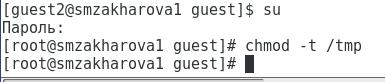{ #fig:029 width=50% }

---

30. Покинула режим суперпользователя командой exit (рис.30).

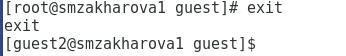{ #fig:030 width=50% }

---

31. От пользователя guest2 проверил, что атрибута t у директории /tmp нет (рис.31).

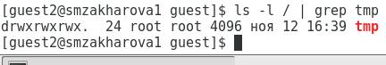{ #fig:031 width=50% }

---

32. Повторила предыдущие шаги.Никаких изменений не произошло (рис.32).

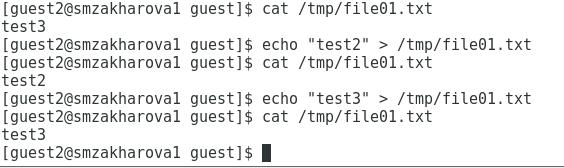{ #fig:032 width=50% }

---

33. Проверила, удалось ли удалить файл от имени пользователя, не являющегося его владельцем? Удалось (рис.33).

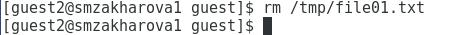{ #fig:033 width=50% }

---

34. Повысила свои права до суперпользователя c помощью команды su - и вернула атрибут t на директорию /tmp (рис.34).

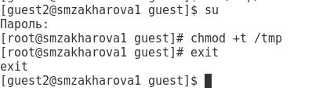{ #fig:034 width=50% }

---
# Выводы

Благодаря данной лабораторной работе, я изучил механизмы изменения идентификаторов, применения SetUID- и Sticky-битов. Получил практические навыки работы в консоли с дополнительными атрибутами. Рассмотрел работу механизма смены идентификатора процессов пользователей, а также влияние бита Sticky на запись и удаление файлов.

---

## {.standout}

Спасибо за внимание!
