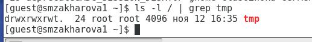

---
# Front matter
title: "Отчёт по лабораторной работе №5"
subtitle: "Дискреционное разграничение прав в Linux. Исследование влияния дополнительных атрибутов"
author: "Захарова Софья Михайловна"

# Generic otions
lang: ru-RU

# Bibliography
bibliography: bib/cite.bib
csl: pandoc/csl/gost-r-7-0-5-2008-numeric.csl

# Pdf output format
toc: true # Table of contents
toc_depth: 2
lof: true # List of figures
lot: true # List of tables
fontsize: 12pt
linestretch: 1.5
papersize: a4
documentclass: scrreprt
## I18n
polyglossia-lang:
  name: russian
  options:
	- spelling=modern
	- babelshorthands=true
polyglossia-otherlangs:
  name: english
### Fonts
mainfont: PT Serif
romanfont: PT Serif
sansfont: PT Sans
monofont: PT Mono
mainfontoptions: Ligatures=TeX
romanfontoptions: Ligatures=TeX
sansfontoptions: Ligatures=TeX,Scale=MatchLowercase
monofontoptions: Scale=MatchLowercase,Scale=0.9
## Biblatex
biblatex: true
biblio-style: "gost-numeric"
biblatexoptions:
  - parentracker=true
  - backend=biber
  - hyperref=auto
  - language=auto
  - autolang=other*
  - citestyle=gost-numeric
## Misc options
indent: true
header-includes:
  - \linepenalty=10 # the penalty added to the badness of each line within a paragraph (no associated penalty node) Increasing the value makes tex try to have fewer lines in the paragraph.
  - \interlinepenalty=0 # value of the penalty (node) added after each line of a paragraph.
  - \hyphenpenalty=50 # the penalty for line breaking at an automatically inserted hyphen
  - \exhyphenpenalty=50 # the penalty for line breaking at an explicit hyphen
  - \binoppenalty=700 # the penalty for breaking a line at a binary operator
  - \relpenalty=500 # the penalty for breaking a line at a relation
  - \clubpenalty=150 # extra penalty for breaking after first line of a paragraph
  - \widowpenalty=150 # extra penalty for breaking before last line of a paragraph
  - \displaywidowpenalty=50 # extra penalty for breaking before last line before a display math
  - \brokenpenalty=100 # extra penalty for page breaking after a hyphenated line
  - \predisplaypenalty=10000 # penalty for breaking before a display
  - \postdisplaypenalty=0 # penalty for breaking after a display
  - \floatingpenalty = 20000 # penalty for splitting an insertion (can only be split footnote in standard LaTeX)
  - \raggedbottom # or \flushbottom
  - \usepackage{float} # keep figures where there are in the text
  - \floatplacement{figure}{H} # keep figures where there are in the text
---

# Цель работы

Изучение механизмов изменения идентификаторов, применения SetUID и Sticky-битов. Получение практических навыков работы в консоли с дополнительными атрибутами. Рассмотрение работы механизма смены идентификатора процессов пользователей, а также влияние бита Sticky на запись и удаление файлов.

# Задание

Лабораторная работа подразумевает работу с виртуальной машиной VirtualBox, операционной системой Linux, дистрибутивом Centos и закрепление теоретических основ получения практических навыков работы в консоли с атрибутами файлов.

# Выполнение лабораторной работы

Вошла в систему от имени пользователя guest. (рис.1).

{ #fig:001 width=70% }

Создала программу simpleid.c. (рис.2).

{ #fig:001 width=70% }

Скомпилировала программу и убедилась, что файл программы создан: "gcc simpleid.c -o simpleid" (рис.3). 

{ #fig:001 width=70% }

Выполнила программу simpleid: ./simpleid (рис.4): 

{ #fig:001 width=70% }

Выполнила системную программу id и сравнила полученный результат с данными предыдущего пункта задания: программа работает верно, результаты совпадают. (рис.5):

{ #fig:001 width=70% }

Усложнила программу, добавив вывод действительных идентификаторов. Получившуюся программу назвала simpleid2.c (рис. 6).

{ #fig:001 width=70% }

Скомпилировала и запустила simpleid2.c (рис.7).

{ #fig:001 width=70% }

От имени суперпользователя выполнила команды:
"chown root:guest /home/guest/simpleid2
chmod u+s /home/guest/simpleid2"
С помощью этих команд файлу simpleid2 изменила владельца и группу на root и guest соответственно, а также установила на файл SetUID-бит. (рис. 8).

{ #fig:001 width=70% }

Временно повысила свои права с помощью команды su (рис. 9).

{ #fig:001 width=70% }

Выполнила проверку правильности установки новых атрибутов и смены владельца файла simpleid2: "ls –l simpleid2" (рис. 10).

{ #fig:001 width=70% }

Запустила simpleid2 и id. Результаты совпадают. (рис.11)

{ #fig:001 width=70% }

Проделала тоже самое относительно SetGID-бита (рис.12). 

{ #fig:001 width=70% }

Создала программу readfile.c (рис.13).

{ #fig:001 width=70% }

Откомпилировала её (рис.14).

{ #fig:001 width=70% }

Сменила владельца у файла readfile.c и изменила права так, чтобы только суперпользователь (root) мог прочитать его, a guest не мог (рис.15).

{ #fig:001 width=70% }

Проверила, что пользователь guest не может прочитать файл readfile.c (рис.16).

{ #fig:001 width=70% }

Сменила у программы readfile владельца и установила SetU’D-бит (рис.17).

{ #fig:001 width=70% }

Проверила, может ли программа readfile прочитать файл readfile.c (рис.18).

{ #fig:001 width=70% }

Проверила, может ли программа readfile прочитать файл /etc/shadow. Может (рис.19).

{ #fig:001 width=70% }

Исследование Sticky-бита

Выяснила, установлен ли атрибут Sticky на директории /tmp, для чего выполнила команду ls -l / | grep tmp (рис.20).

{ #fig:001 width=70% }

От имени пользователя guest создала файл file01.txt в директории /tmp со словом test: echo & quot;test& quot; & gt; /tmp/file01.txt (рис.21).

{ #fig:001 width=70% }

Просмотрела атрибуты у только что созданного файла и разрешила чтение и запись для категории пользователей «все остальные». Первоначально все группы имели право на чтение, а запись могли осуществлять все, кроме «остальных пользователей» (рис.22).

{ #fig:001 width=70% }

От пользователя guest2 (не являющегося владельцем) попробовала прочитать файл /tmp/file01.txt (рис.23).

{ #fig:001 width=70% }

От пользователя guest2 попробовала дозаписать в файл /tmp/file01.txt слово test2, стерев при этом всю имеющуюся в файле информацию с помощью команды echo & quot;test2& quot; & gt; /tmp/file01.txt. Выполнить операцию удалось (рис.24).

{ #fig:001 width=70% }

Проверила содержимое файла командой cat /tmp/file01.txt (рис.25).

{ #fig:001 width=70% }

От пользователя guest2 попробовала дозаписать в файл /tmp/file01.txt слово test3 командой echo & quot;test3& quot; & gt; /tmp/file01.txt. Выполнить операцию удалось (рис.26).

{ #fig:001 width=70% }

Проверила содержимое файла командой cat /tmp/file01.txt (рис.27).

{ #fig:001 width=70% }

От пользователя guest2 попробовала удалить файл /tmp/file01.txt c помощью команды rm /tmp/file0l.txt. Удалить файл не удалось (рис.28).

{ #fig:001 width=70% }

Повысила свои права до суперпользователя командой su - и выполнил после этого команду, снимающую атрибут t (Sticky-бит) с директории /tmp: chmod –t /tmp (рис.29).

{ #fig:001 width=70% }

Покинула режим суперпользователя командой exit (рис.30).

{ #fig:001 width=70% }

От пользователя guest2 проверил, что атрибута t у директории /tmp нет (рис.31).

{ #fig:001 width=70% }

Повторила предыдущие шаги.Никаких изменений не произошло (рис.32).

{ #fig:001 width=70% }

Проверила, удалось ли удалить файл от имени пользователя, не являющегося его владельцем? Удалось (рис.33).

{ #fig:001 width=70% }

Повысила свои права до суперпользователя c помощью команды su - и вернула атрибут t на директорию /tmp (рис.34).

{ #fig:001 width=70% }

# Выводы

Благодаря данной лабораторной работе, я изучил механизмы изменения идентификаторов, применения SetUID- и Sticky-битов. Получил практические навыки работы в консоли с дополнительными атрибутами. Рассмотрел работу механизма смены идентификатора процессов пользователей, а также влияние бита Sticky на запись и удаление файлов.
